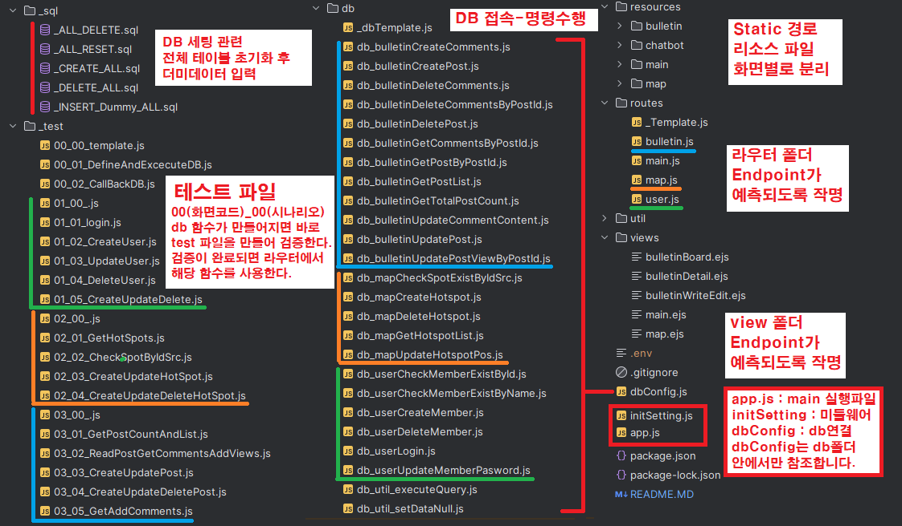
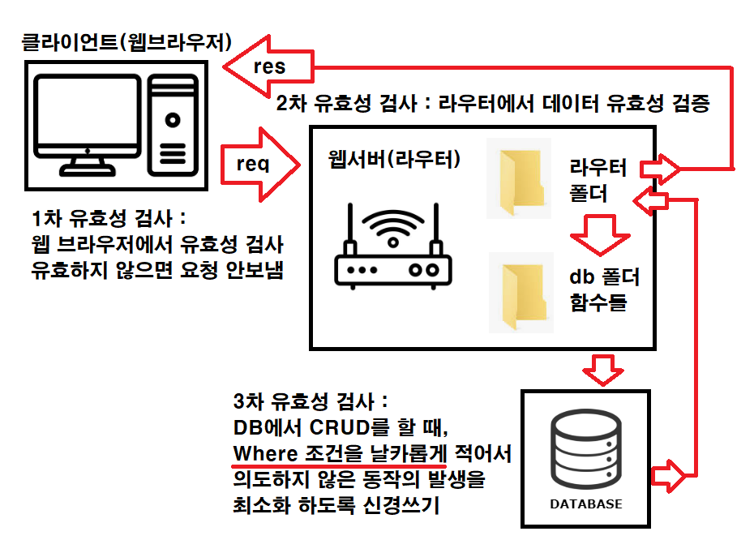
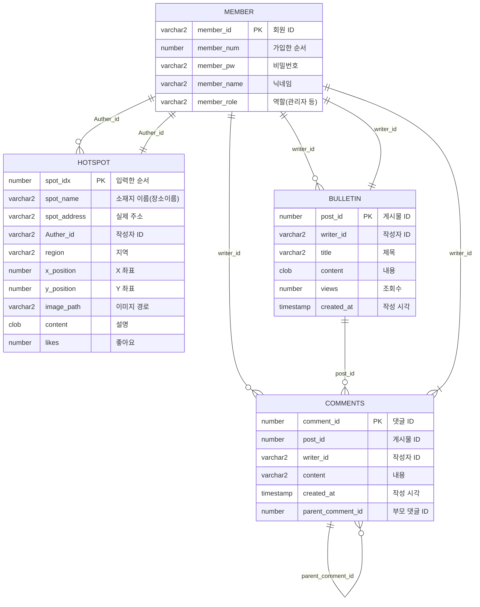
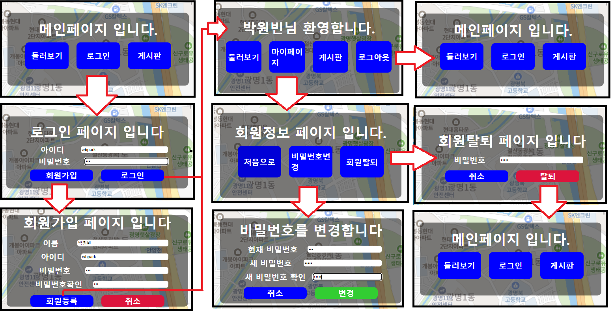
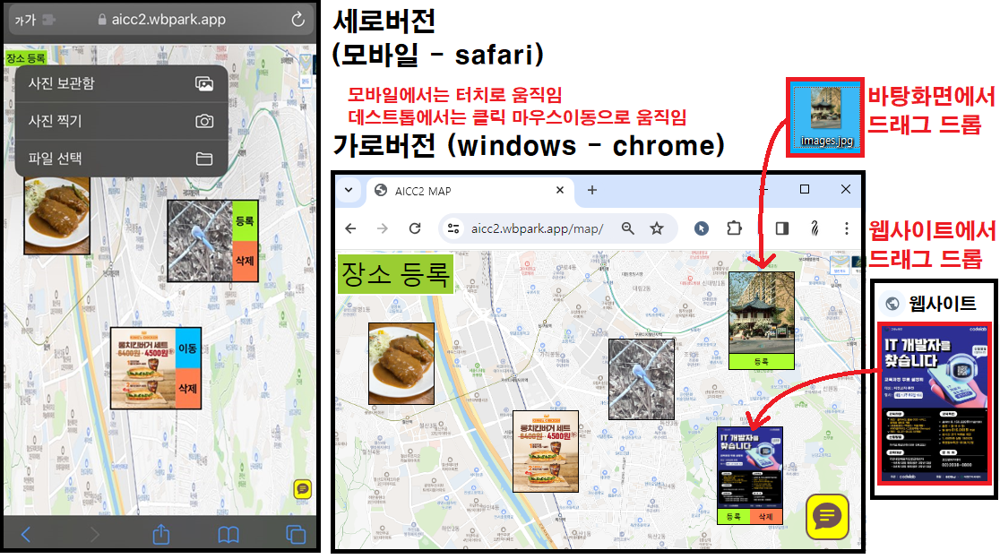
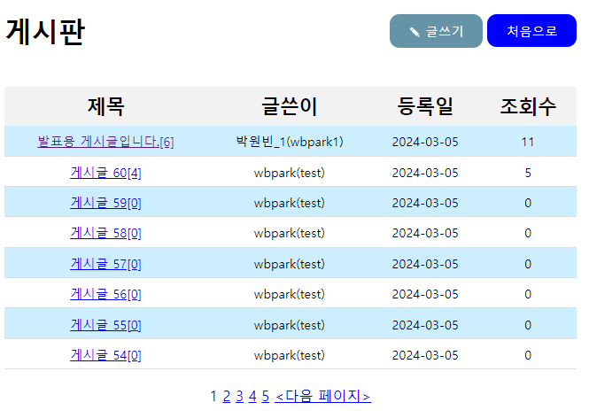
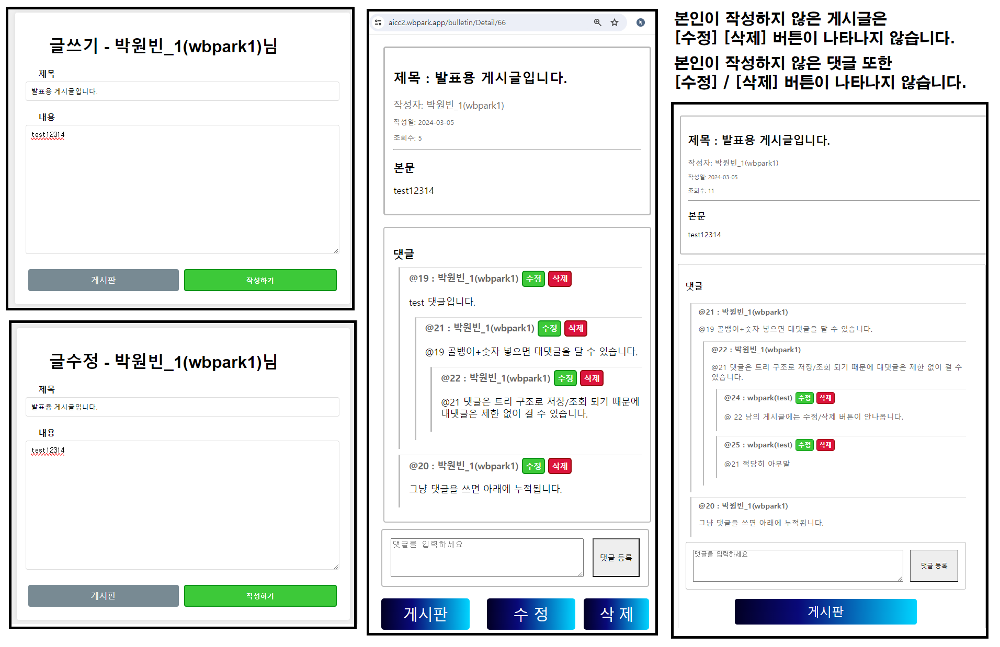
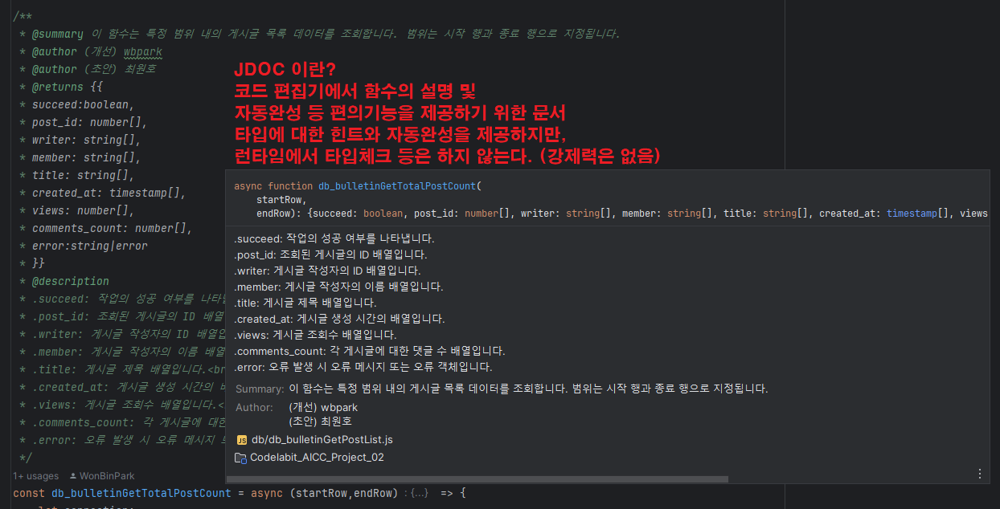
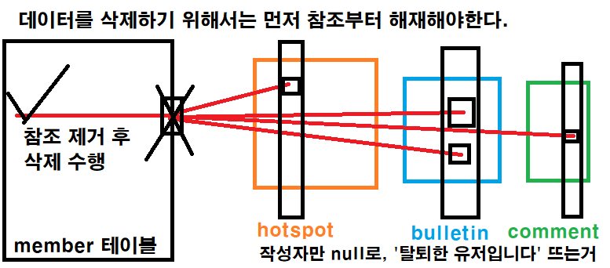

## 코드랩 아카데미 AICC 2차 프로젝트

## 배포  : 
- 현재 프로젝트 배포 :
  -  https://aicc2.wbpark.app
- 이전 프로젝트 경로 : 
  - https://parkwonbin.github.io/AICC_Proj1/ 
- 데모 프로젝트 경로 : 
  - https://parkwonbin.github.io/AICC_Proj2/map/
  - https://parkwonbin.github.io/AICC_Proj2/demo/
  - https://parkwonbin.github.io/AICC_Proj2/chart/

### 인원 및 기여 : 
- 박원빈 (조장) :
  -  설계 : 폴더 구조, 변수명 규칙, 함수 인터페이스 정의 구현
  -  탬플릿 : 개발 템플릿 [라우터, db, 테스트] 생성 및 공유
  -  문서 : 코드 내 주석 (의도,목적,기능,역할,주의사항 등) 기록 및 JDOC, README 작성
  -  배포 : AWS EC2, Route53, HSTS, 서브도메인  https://aicc2.wbpark.app
  -  테스트 : 테스트 시나리오 정의 및 테스트 작성
  -  피드백 : 각 조원이 개발한 코드에 대해 테스트 및 코드리뷰 후 프로젝트에 적용
  -  백업1 : (/map) : 클라이언트(비동기요청/모바일지원/드래그/드롭), 서버(파일 저장/삭제)
  -  백업2 : (/main, /user) : view를 ejs 하나로 통합, 회원 탈퇴 시 참조 레코드 제거
  -  백업3 : (/bulletin) : 트리 구조로 댓글 [등록, 조회, 삭제]
  -  백업4 : (/chatbot) : 응답하는 로직과 대본에 해당하는 데이터를 분리
- 이정훈 :
  - 기여 : 프로젝트 내 **(/main, /user)** 영역 개발 (프론트, 백앤드, 쿼리)
  - 개발 : 회원관리 [가입, 로그인, 비밀번호 변경, 탈퇴] 페이지 및 기능 개발
  - 비고 : 회원 관리 화면 초안 제작, 회원관리 기능 테스트
- 위지은 : 
  - 기여 : 프로젝트 내 **(/map, /chatbot)** 영역 개발 (프론트, 백앤드, 쿼리)
  - 개발 : 이미지 [등록, 조회, 이동, 삭제]에 대한 백앤드 처리. 쳇봇 페이지 및 기능 개발
  - 비고 : 화면에 넣을 컨텐츠 제안 (시간상 넣지 못했지만, 참고할 공공데이터 조사)
- 최원호 :
  - 기여 : 프로젝트 내 **(/bulletin)** 영역 개발 (프론트, 백앤드, 쿼리)
  - 개발 : 게시판 [게시글 목록 조회], 게시글 [등록, 조회, 수정, 삭제] 페이지 및 기능 개발
  - 비고 : DB 스키마 설계 및 제안 (테이블명, 필드명, 테이블 관계, 제약조건 등)

### 기술
- 프랫폼 : NodeJS
- 서버 : Express, Nginx
- DB : Oracle 11g

---

### 목차
1. 중점 사항
2. 이름 규칙
3. 폴더 구조
4. DB 스키마
5. 화면 및 기능
6. 테스트 코드
7. 개선 사항

---

### 1. 중점 사항 
1. 팀원의 개발 역량 향상을 제일 목적으로 한다.
   - 모든 인원이 적어도 하나의 테이블에 대해서 CRUD 기능 구현한다.
   - 학습 자료로 바로 사용할 수 있는 형태의 코드을 목표로 한다. 
     - 주석으로 의도,목적,기능,역할,주의사항 등을 표시한다.
     - 데이터 취득, 로직 계싼, 함수 호출, 결과물 반황 등은 일관성을 유지도록 한다.
     - db와 연결된 함수의 경우 JDOC으로 입출력 및 역할과 기능에 대해 간략히 기록한다.
   - 자세한 내용은 인원 소개 및 기여 내역 참고 
2. 웹서버와 Express 프레임워크에 대해 이해한다. 
   - 클라이언트 & 서버 : 코드를 실행시키는 주체와 해당 함수의 역할에 대해 대해 파악한다.
   - 요청 & 응답 : 데이터를 취득하고 가공하여 결과 화면을 그리는 절차를 숙지한다.
   - Express & OracleDB : 웹 서버와 DB 서버가 어떻게 연동되어 동작하는지 파악한다. 
   - Model & View & Controller : 데이터(DB처리) & 레이아웃(화면처리), & 라우팅(명령전달) 을 구분한다.
3. 클라이언트 사이드, 서버 사이드의 차이에 대해 숙지한다.
   - 웹 브라우저에서 작동하는 JS 파일과, 서버에서 동작하는 JS 파일을 구분한다.
   - 클라이언트, 라우팅, 쿼리명령 절차에서 요청을 검증하고 방어적으로 코드를 작성한다.
4. 여러 종류의 디바이스 작동하는 웹앱을 만들어본다.
   - 클라이언트 사이드 코드를 모듈화 하여, 클릭 이벤트와 터치이벤트에 등록해준다.
   - 브라우저 종류(Safari,Chrom)에 따른 이벤트 등록 및 CSS 처리에 대해 인지한다.
5. 클라우드 환경 배포
   - 상용 환경에서 웹페이지를 배포하고 관리하는 요령을 체득한다.
   - 호스팅(Route53 서브도메인), 로드 벨런싱(nginx), 안전한 요청(HSTS)을 공부한다.

### 2. 이름 규칙 
#### 목적 :
코드작성 및 의사소통 시 이름으로 인한 혼란을 최소화 한다.

#### 대전제 : 
 - 컨벤션 : 
   - NodeJS 플랫폼에서 돌아가는 코드는 기본적으로 카멜 표시법을 사용한다.
   - SQL 쿼리 등 대소문자 구분이 불가할 떄는 스네이크 표시법을 사용한다.
   - 프로젝트에 포함되지 않는 파일은 파일명 앞에 언더바로 표시한다.
     - 예시1 : _envTemplate 등, 환경에 따라 변경할 파일의 예시 템플릿
     - 예시2 : _sql, _test, _PT 등 프로젝트 수행에 관여하지 않는 폴더
     - 예시3 : _dbTemplate.js, _Template.js 등 개발 템플릿
     - 예시4 : 테스트가 완료되지 않은 작성중인 파일
       - 템플릿을 미리 복사하여 어떤 이름으로 기능을 만들지 체크해둔 경우.
       - HotFix가 필요한 기능의 경우 원본을 남겨두고 _동일이름으로 파일 생성 디버깅.
       - 폴더 트리를 통해 개발중인 기능과 개발 완료된 기능을 파악하기 위한 용도로도 사용.
 - 변수명 : 
   - 변수는 자신의 데이터 예측할 수 있는 이름을 사용한다.
   - 외부 파일에서 함수를 import한 경우, 함수명/파일명/변수명 등을 모두 일치시킨다.
   - db등 주요 함수의 수행결과를 객체로 받은 경우, 해당 함수명과 유사한 이름을 작성한다.
   - 배열의 경우 복수형으로, 트리구조의 경우 'Tree' 키워드를 붙여서 표시한다.
   - 특정 시나리오에서만 사용하는 변수는 해당 시나리오를 연상시킬 수 있는 이름을 사용한다.
 - 함수명 : 
   - 함수는 자신의 기능을 묘사할 수 있는 이름을 사용한다.
   - 기능이 CRUD 관점에 부합하는 기능은 이름에 CRUD에 키워드를 포함시킨다.
   - READ의 경우, 의도와 목적이 명확할 시 READ 대신에 해당 키워드를 사용한다.
     - 예시1 : 데이터의 목록을 조회하는 경우 Get 키워드를 사용한다.
     - 예시2 : 로그인(ID/PW 일치여부 조회)는 명확한 기능명 login을 사용한다.
     - 예시3 : 데이터가 존재 여부 확인(boolean 반환)은 (Check) ~ Exist 키워드 포함한다.
     - 이유 : 등록/수정/삭제는 기능명이 곧 의도와 목적을 나타내지만, 조회의 경우 해당 데이터를 조회하는 의도나 목적, 혹은 예상되는 결과 등으로 세분화 하여 관리하는 것이 프로젝트 복잡도가 커졌을 때 혼란을 방지할 수 있기 때문이다. 
 - 파일명 : 
   - 함수를 exprot하는 파일의 경우, 함수명과 파일명을 일치시키도록 한다.
   - 라우터와 관련된 파일의 경우 엔드포인트를 예상할 수 있는 이름을 사용하도록 한다.
   - 특정 엔드포인트에서만 사용하는 ejs는 해당 앤드포인트와 관련된 이름을 사용한다.
 - 폴더명 : 
   - 해당 폴더 내 파일들의 역할이나 성격을 예상할 수 있는 이름을 사용한다.
   - 파일들의 역할이 명확하고 서로 독립적인 경우 폴더를 구분하여 관리한다.
   - routes, db, resources, util, _test 등 역할별로 폴더를 분리하여 관리한다.
   - static 경로(resources)는 라우팅 경로에 따른 리소스 파일을 분리하여 관리한다.

---

### 3. 폴더 구조


#### `/sql`
데이터베이스 환경세팅을 위한 PLSQL 스크립트를 모아놨습니다.  
해당 계정 내 모든 테이블과 시퀀스를 제거, 테이블 생성, 더미데이터 추가 등  
로컬 및 클라우드 환경에서 초기 테스팅 환경을 만드는 내용이 담겨있습니다.

#### `/db`
dbConfig 로부터 db의 연결정보를 받아 쿼리를 수행합니다.  
Oracle DB에 접근하여 명령을 수행하고 결과를 반환하는 함수들을 넣어놨습니다.  
프로젝트 내에서 유일하게 db와 직접 연결되어있는 함수들입니다.  
db연결과 관련하여 이슈가 발생할 시 해당 폴더 내 함수들만 확인하여 관리합니다.   
폴더 내 파일들은 해당 함수를 사용하는 화면과 기능을 예측할 수 있는 이름을 사용합니다.  
구현이 완려된 함수는 `_test` 폴더에서 테스트케이스를 정의하고 시나리오데로 테스트를 수행합니다.

#### `/resources`
Express에서 호스팅하는 정적(Static) 경로입니다.  
`bulletin`, `chatbot`, `main`, `map` 등 화면간 리소스를 분리하여 저장합니다.  
각 폴더의 하위 폴더로는 JS,CSS,Images 등이 있으며, 이미지 업로드 시 Image/uploads 폴더에 저장됩니다. 이미지의 이름은 해당 파일이 저장되는 시점의 타임스템프를 사용합니다.

#### `/routes`
HTTP 요청에 대한 엔드포인트를 정의하는 라우팅 파일을 저장합니다.   
각 파일은 사용자, 지도, 게시판 등 다른 부분에 해당하는 라우트에 대응됩니다.  

#### `/views`
프로젝트 내 뷰에 템플릿 파일을 모아서 관리합니다. 

#### `/util`
파일 삭제 검사, 문자에서 숫자 추출, 데이터 변환 유틸리티 등   
프로젝트 전반에 걸쳐 공통 기능에 해당하는 파일들을 모아서 관리합니다.

---

#### 프로젝트 구조


### 4. DB 스키마



### 5. 화면 및 기능

#### 5.1. `main` : 접속 및 회원정보
##### 5.1.1. 메인, 회원가입, 로그인, 마이페이지, 비밀번호 변경, 회원탈퇴  

- get : `/main`
- get : `/main/login`
- get : `/main/CreateUser`
- get : `/main/UpdateUser`
- get : `/main/DeleteUser`

##### 5.1.2. main 화면의 요청은 다음 엔드포인트에서 처리합니다.
`/user`에서 요청에 대한 처리가 끝나면 `/main`의 화면으로 리다이렉트 시켜줍니다.
- get : `/user/logout`
- post : `/user/login`
- post : `/user/create`
- post : `/user/update`
- post : `/user/delete`

#### 5.2. `map`
##### 5.2.1. 장소 등록, 장소 위치 수정, 장소 삭제



- get : `/map`
- post : `/map/create`
- post : `/map/update`
- post : `/map/delete`

#### 5.3 `bulletin`
##### 5.3.1. 게시물 목록 조회

   
- get : `/bulletin`

##### 5.3.2. 게시물 조회,게시물 작성, 게시물 수정, 게시물 삭제, 댓글 등록, 댓글 삭제


- get : `/bulletin/Detail/:postId`
- get : `/bulletin/write`
- post : `/bulletin/write`
- post : `/bulletin/edit`
- post : `/bulletin/delete`
- post : `/bulletin/addComment`
- post : `/bulletin/deleteComment`

### 6. 테스트 코드




#### 6.1. user - 회원 가입부터 탈퇴까지

##### 6.1.1. Test Code
```js
// 환경변수 불러오고 출력해보기
require('dotenv').config({ path: '../.env' })
console.log("IP : " + process.env.DB_CONNECT_STRING)
console.log("ID : " + process.env.DB_USER)

// oracledb 환경설정하기
const oracledb = require('oracledb');
oracledb.initOracleClient({ libDir: process.env.ORACLEDB_INITORACLECLIENT });
oracledb.autoCommit = true;

//////////////////////////////////
const moment = require('moment');
const db_userCheckMemberExistById = require("../db/db_userCheckMemberExistById");
const db_userCheckMemberExistByName = require("../db/db_userCheckMemberExistByName");
const db_userCreateMember = require("../db/db_userCreateMember");
const db_userUpdateMemberPasword = require("../db/db_userUpdateMemberPasword");
const db_setDataNull = require("../db/db_util_setDataNull");
const db_userDeleteMember = require("../db/db_userDeleteMember");

// 무명함수를 이용하여 비동기함수 실행 예시
(async ()=>{

    const formattedDateTime = moment().format('YYYYMMDD_HHmmss_ms');

    // 아이디 안겹치게 하려고 현재시기 밀리초 단위로 가져와서 id/name 에 넣음.
    const userName = 'test_'+formattedDateTime
    const userId = 'test_'+formattedDateTime
    const userPw = formattedDateTime
    console.log({id: userId, name: userName, pw: userPw})

    const checkId = await db_userCheckMemberExistById(userId)
    console.log("id 중복여부 : "+checkId.memberExist)

    const checkName = await db_userCheckMemberExistByName(userName)
    console.log("name 중복여부 : "+checkName.memberExist)

    const userCreateMember = await db_userCreateMember(userId,userPw,userName)
    console.table(userCreateMember)
    console.log(`회원가입 : ${(userCreateMember.succeed)?"성공":"실패"}`)

    // 비밀번호 변경 시도
    const userPwNew = 'test123'
    console.log(`비밀번호 변경 시도 : ${userPwNew}`)
    const userUpdateMemberPasword = await db_userUpdateMemberPasword(userId,userPw, userPwNew)
    console.table(userUpdateMemberPasword)
    console.log(`비밀번호 변경 : ${userUpdateMemberPasword.succeed?"성공":"실패"}`)

    //회원탈퇴 전에 댓글,게시글,장소등록 등에 등록했던 데이터를 모두 참조 해제합니다.
    const relatedData = [
        {tableName:'comments', columnName:'writer_id'},
        {tableName:'bulletin', columnName:'writer_id'},
        {tableName:'hotspot', columnName:'auther_id'}
    ]

    // 비동기 함수들이 모두 수행될 때까지 기다렸다가 합치는 함수.
    // 여러개의 비동기 함수를 동시실행 후 리턴값을 수집하려면 promise all
    console.log('user 테이블을 참조하는 테이블들에서, 해당 레코드의 참조 제거 시도')
    const deleteDatalog = await Promise.all(
        relatedData.map(data =>
            db_setDataNull(data.tableName, data.columnName, userId)
                .then(result => {
                    return {...data, id: userId, ...result}
                })
        )
    );
    console.table(deleteDatalog);
    
    // 2.3. 맴버 삭제 시도
    console.log('맴버 삭제 시도')
    const userDeleteMember = await db_userDeleteMember(userId,userPwNew)
    console.table(userDeleteMember);
    console.log(`회원 삭제 : ${userDeleteMember.succeed?"성공":"실패"}`)

})()
```
##### 6.1.2. Test Result
```js
IP : localhost:1521
ID : AICC2
{                                   
  id: 'test_20240305_151034_1034',  
  name: 'test_20240305_151034_1034',
  pw: '20240305_151034_1034'        
}                                   
id 중복여부 : false
name 중복여부 : false
┌────────────┬─────────────────────────────┐
│ (index)    │ Values                      │
├────────────┼─────────────────────────────┤
│ succeed    │ true                        │
│ memberNum  │ 12                          │
│ memberId   │ 'test_20240305_151034_1034' │
│ memberName │ 'test_20240305_151034_1034' │
│ memberRole │ null                        │
│ error      │ null                        │
└────────────┴─────────────────────────────┘
회원가입 : 성공             
비밀번호 변경 시도 : test123
┌─────────┬────────┐
│ (index) │ Values │
├─────────┼────────┤
│ succeed │ true   │
│ error   │ null   │
└─────────┴────────┘
비밀번호 변경 : 성공
user 테이블을 참조하는 테이블들에서, 해당 레코드의 참조 제거 시도
┌─────────┬────────────┬─────────────┬─────────────────────────────┬─────────┬──────────────┬───────┐
│ (index) │ tableName  │ columnName  │ id                          │ succeed │ rowsAffected │ error │
├─────────┼────────────┼─────────────┼─────────────────────────────┼─────────┼──────────────┼───────┤
│ 0       │ 'comments' │ 'writer_id' │ 'test_20240305_151034_1034' │ true    │ 0            │ null  │
│ 1       │ 'bulletin' │ 'writer_id' │ 'test_20240305_151034_1034' │ true    │ 0            │ null  │
│ 2       │ 'hotspot'  │ 'Auther_id' │ 'test_20240305_151034_1034' │ true    │ 0            │ null  │
└─────────┴────────────┴─────────────┴─────────────────────────────┴─────────┴──────────────┴───────┘
맴버 삭제 시도
┌─────────┬────────┐
│ (index) │ Values │
├─────────┼────────┤
│ succeed │ true   │
│ error   │ null   │
└─────────┴────────┘
회원 삭제 : 성공

Process finished with exit code 0
```

#### 2. map - 이미지 등록부터 삭제까지
##### 6.1.1. Test Code
```js
require('dotenv').config({path: '../.env'})
console.log("IP : " + process.env.DB_CONNECT_STRING)
console.log("ID : " + process.env.DB_USER)

// oracledb 환경설정하기
const oracledb = require('oracledb');
oracledb.initOracleClient({libDir: process.env.ORACLEDB_INITORACLECLIENT});
oracledb.autoCommit = true;
///////////////////////////////////

const path = require("path");
const imgUploadDir = path.join(__dirname, '../resources/map/images/upload');

const db_mapCreateHotspot = require("../db/db_mapCreateHotspot");
const db_mapUpdateHotspotPos =  require("../db/db_mapUpdateHotspotPos")
const db_mapDeleteHotspot  = require('../db/db_mapDeleteHotspot')
const saveBase64AndReturnFileNameByCurrentTime = require("../util/util_saveBase64AndReturnFileNameByCurrentTime");

// 무명함수를 이용하여 비동기함수 실행 예시
(async () => {
    const sportName = 'test'
    const base64Data = 'data:image/png;base64,iVBORw0KGgoAAAANSUhEUgAAADMAAAAVCAIAAABkNkFWAAAAAXNSR0IArs4c6QAAAARnQU1BAACxjwv8YQUAAAAJcEhZcwAADsMAAA7DAcdvqGQAAAE9SURBVEhL7ZbbEYQgDEWti4Koh2pohmLc4Ea4hCTq6Dj7secTYnJ4hHFZf5VuVlIMTMw89gZWXTQLC/OymV73b2bjmuXIUwMhlS0EKLleCp6niBBTnoIYEasFu3UvmOUIdZA428FGCDDrI2Z2qYpYhJ5vpwcfm2249wxz7FtUcBPxkx4c2vnR2erB/j3b8MxA7DirlYgWwkTjNK6b2VN9pp8RRNPwdu9BZOKWmX9vmP7RoNYxOvlNM8LsYxIUrfyQmWhClyJftMaQ5ZaZM3WSkqsl5xjVbpnhcY5zVHFnr2XGGlt/zSyVCk9U8Ka1R4oeNB7CWpCn1mpZcBwVrLqq2RfrNmgMq8VlqAzRVt1uNoUMZoTZbzKQUnm9KaONumBWoXZKkVEeH2q3+pBzCkri/Wuc+NloKHWF2c+wrh+XAAnZ7FGq7AAAAABJRU5ErkJggg=='
    const top = 30
    const left = 20

    // 2. 이미지 저장 시도
    const saveFile = saveBase64AndReturnFileNameByCurrentTime(base64Data, imgUploadDir);
    console.log(`이미지 저장 : ${saveFile.succeed? "성공" : "실패"}`)
    console.log(`이미지 저장 : ${JSON.stringify(saveFile,null,2)}`)

    // 3. db 등록
    const CreateHotspot = await db_mapCreateHotspot(saveFile.fileName, sportName, top, left);
    console.log(`이미지 등록 : ${CreateHotspot.succeed? "성공" : "실패"}`)
    console.log(`이미지 등록 : ${JSON.stringify(CreateHotspot,null,2)}`)

    // 4. 이미지 이동 시도
    const NewTop = top + 10
    const NewLeft = left + 10
    console.log(`이미지 이동 : spotId${CreateHotspot.spotId} NewTop:${NewTop}, NewLeft:${NewLeft}`)
    const mapdateHotspotPos = await db_mapUpdateHotspotPos(CreateHotspot.spotId,NewLeft,top);
    console.log(`이미지 이동 : ${mapdateHotspotPos.succeed? "성공" : "실패"}`)
    console.log(`이미지 이동 : ${JSON.stringify(CreateHotspot,null,2)}`)

    // 5. 이미지 삭제 시도
    console.log(`이미지 삭제 : spotId : ${CreateHotspot.spotId}`)
    const mapDeleteHotspot = await db_mapDeleteHotspot(CreateHotspot.spotId)
    console.log(`이미지 삭제 : ${mapDeleteHotspot.succeed? "성공" : "실패"}`)
    console.log(`이미지 이동 : ${JSON.stringify(mapDeleteHotspot,null,2)}`)
})()
```
##### 6.1.2. Test Code
```js
IP : localhost:1521
ID : AICC2
1709619315213.png 파일 저장 성공!
이미지 저장 : 성공                
이미지 저장 : {                   
  "succeed": true,                
  "fileName": "1709619315213.png",
  "error": null                   
}                                 
이미지 등록 : 성공
이미지 등록 : {                             
  "succeed": true,                          
  "spotId": 21,                             
  "error": null                             
}                                           
이미지 이동 : spotId21 NewTop:40, NewLeft:30
이미지 이동 : 성공       
이미지 이동 : {          
  "succeed": true,       
  "spotId": 21,          
  "error": null          
}                        
이미지 삭제 : spotId : 21
이미지 삭제 : 성공
이미지 이동 : {
  "succeed": true,
  "error": null
}

Process finished with exit code 0
```

#### 2. bulletin - 게시글 생성, 수정, 삭제
##### 6.1.1. Test Code
```js
// 환경변수 불러오고 출력해보기
require('dotenv').config({ path: '../.env' })
console.log("IP : " + process.env.DB_CONNECT_STRING)
console.log("ID : " + process.env.DB_USER)

// oracledb 환경설정하기
const oracledb = require('oracledb');
oracledb.initOracleClient({ libDir: process.env.ORACLEDB_INITORACLECLIENT });
oracledb.autoCommit = true;
///////////////////////////////////
const db_bulletinCreatePost = require('../db/db_bulletinCreatePost');
const db_bulletinUpdatePost = require('../db/db_bulletinUpdatePost');
const db_bulletinDeletePost = require('../db/db_bulletinDeletePost');
// 무명함수를 이용하여 비동기함수 실행 예시
(async ()=>{
    // 글작성에 필요한 데이터
    const writerId = 'test'
    const postTitle = '테스트입니다.'
    const postContent = '아무말 테스트'

    // 글 작성 시도
    console.log('게시글 작성 시도')
    const createPost = await db_bulletinCreatePost(writerId, postTitle, postContent)
    console.log(createPost)

    // 글 수정 시도
    const postTitleNew = postTitle + " (수정함)"
    const postContentNew = postContent + " (수정함)"

    console.log("게시글 수정 시도")
    const updatePost = await db_bulletinUpdatePost(createPost.postId, postTitleNew, postContentNew);
    console.log(updatePost)

    console.log("게시글 삭제 시도")
    const deletePost = await db_bulletinDeletePost(createPost.postId)
    console.log(deletePost)
})()
```
##### 6.1.2. Test Code
```js
IP : localhost:1521
ID : AICC2
1709619315213.png 파일 저장 성공!
이미지 저장 : 성공                
이미지 저장 : {                   
  "succeed": true,                
  "fileName": "1709619315213.png",
  "error": null                   
}                                 
이미지 등록 : 성공
이미지 등록 : {                             
  "succeed": true,                          
  "spotId": 21,                             
  "error": null                             
}                                           
이미지 이동 : spotId21 NewTop:40, NewLeft:30
이미지 이동 : 성공       
이미지 이동 : {          
  "succeed": true,       
  "spotId": 21,          
  "error": null          
}                        
이미지 삭제 : spotId : 21
이미지 삭제 : 성공
이미지 이동 : {
  "succeed": true,
  "error": null
}

Process finished with exit code 0

```

### 7. 개선사항
#### 1.main
- [ ] id 유효성 검사 fromt에서도 검증하기
- [ ] name 유효성 검사 fromt에서도 검증하기
- [ ] name 수정하는 기능도 추가해보기
#### 2.map
- [ ] 등록버튼 눌렀을 떄 추가정보 입력하는 모달창 나오게 하기
- [ ] 이미지 크기를 확인하고, 등록할 수 없는 크기면 경고 띄워주기
- [ ] 이미지 크기를 확인하고 저화질로 압축해서 올릴 수 있도록 설정하기
- [ ] 가끔씩 등록버튼 동작 안하는 문제 원인 파악하기 (새로고침 하면 작동함)
- [ ] 여러명이 접속했을 떄, 한 명이 이미지 잡고 움직이면 실시간으로 변경내용 공유되게 해보기
- [ ] Ctrl+C로 이미지 복사하고, Ctrl+V로 이미지 추가하는 기능도 만들어보기
- [ ] main 으로 돌아가는 버튼 만들기
#### 3.bulletin
- [ ] 게시글 검색 및 필터링 기능 추가
- [ ] 한 화면에 표시할 게시글 개수와 페이지 개수를 가변적으로 지정할 수 있도록 해보기
- [ ] 이미지 등 멀티미디어 파일 업로드 기능 추가
- [ ] 대댓글에서 수정 기능 구현하기
- [ ] 특정 조건에서 발생하는 페이지/댓글 관련 이슈 해결하기

