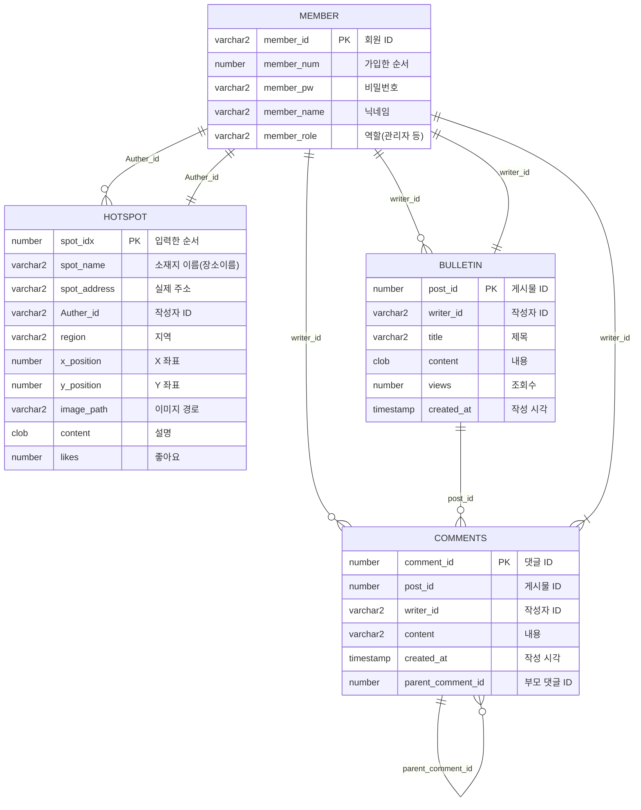

## 코드랩 아카데미 AICC 2차 프로젝트
### 인원 및 기여 : 
- 박원빈 (조장) :
  -  설계 : 폴더 구조, 변수명 규칙, 함수 인터페이스 정의 구현
  -  탬플릿 : 개발 템플릿 [라우터, db, 테스트] 생성 및 공유
  -  문서 : 코드 내 주석 (의도,목적,기능,역할,주의사항 등) 기록 및 JDOC, README 작성
  -  배포 : AWS EC2, Route53, HSTS, 서브도메인  https://aicc2.wbpark.app
  -  테스트 : useCase 정의 및 테스트 코드 생성
  -  피드백 : 각 조원이 개발한 코드에 대해 테스트 및 코드리뷰 후 프로젝트에 적용
  -  백업1 : (/map) : 클라이언트(비동기요청/모바일지원/드래그/드롭), 서버(파일 저장/삭제)
  -  백업2 : (/main, /user) : view를 ejs 하나로 통합, 회원 탈퇴 시 참조 레코드 제거
  -  백업3 : (/bulletin) : 트리 구조로 댓글 [등록, 조회, 삭제]
  -  백업4 : (/chatbot) : 응답하는 로직과 대본에 해당하는 데이터를 분리시킴
- 이정훈 :
  - 기여 : 프로젝트 내 **(/main, /user)** 영역 개발 (프론트, 백앤드, 쿼리)
  - 개발 : 회원관리 [가입, 로그인, 비밀번호 변경, 탈퇴] 페이지 및 기능 개발
  - 비고 : 회원 관리 화면 초안 제작, 회원관리 기능 테스트
- 위지은 : 
  - 기여 : 프로젝트 내 **(/map, /chatbot)** 영역 개발 (프론트, 백앤드, 쿼리)
  - 개발 : 이미지 [등록, 조회, 이동, 삭제]에 대한 백앤드 처리. 쳇봇 페이지 및 기능 개발
  - 비고 : 화면에 넣을 컨텐츠 제안 (시간상 넣지 못했지만, 참고할 공공데이터 조사)
- 최원호 :
  - 기여 : 프로젝트 내 **(/bulletin)** 영역 개발 (프론트, 백앤드, 쿼리)
  - 개발 : 게시판 [게시글 목록 조회], 게시글 [등록, 조회, 수정, 삭제] 페이지 및 기능 개발
  - 비고 : DB 스키마 설계 및 제안 (테이블명, 필드명, 테이블 관계, 제약조건 등)

### 기술
- 프랫폼 : NodeJS
- 서버 : Express, Nginx
- DB : Oracle 11g

---

### 목차
1. 중점 사항
2. 이름 규칙
3. **작업 요령** : 템플릿, 테스트
4. **주요 로직** : 화면별 주요내용
5. **코드 예시** : 인터페이스, JDOC
6. 추후 개선 사항

---

### 1. 프로젝트 중점 사항 : 
1. 모든 인원이 적어도 하나의 테이블에 대해서 CRUD 기능 구현한다.
   - 인원 소개 및 기여 내역 참고 
2. 웹서버와 Express 프레임워크에 대해 이해한다. 
   - 클라이언트 & 서버 : 코드를 실행시키는 주체와 해당 함수의 역할에 대해 대해 파악한다.
   - 요청 & 응답 : 데이터를 취득하고 가공하여 결과 화면을 그리는 절차를 숙지한다.
   - Express & OracleDB : 웹 서버와 DB 서버가 어떻게 연동되어 동작하는지 파악한다. 
   - Model & View & Controller : 데이터(DB처리) & 레이아웃(화면처리), & 라우팅(명령전달) 을 구분한다.
3. 클라이언트 사이드, 서버 사이드의 차이에 대해 숙지한다.
   - 웹 브라우저에서 작동하는 JS 파일과, 서버에서 동작하는 JS 파일을 구분한다.
   - 클라이언트, 라우팅, 쿼리명령 절차에서 요청을 검증하고 방어적으로 코드를 작성한다.
4. 여러 종류의 디바이스 작동하는 웹앱을 만들어본다.
   - 클라이언트 사이드 코드를 모듈화 하여, 클릭 이벤트와 터치이벤트에 등록해준다.
   - 브라우저 종류(Safari,Chrom)에 따른 이벤트 등록 및 CSS 처리에 대해 인지한다.
5. 클라우드 환경 배포
   - 상용 환경에서 웹페이지를 배포하고 관리하는 요령을 체득한다.
   - 호스팅(Route53 서브도메인), 로드 벨런싱(nginx), 안전한 요청(HSTS)을 공부한다.

### 2. 프로젝트 내 이름 규칙 : 
#### 기본 컨셉 
목적 : 코드작성 및 의사소통 시 이름으로 인한 혼란을 최소화 한다.
대전제 : 
 - 컨벤션 : 
   - NodeJS 플랫폼에서 돌아가는 코드는 기본적으로 카멜 표시법을 사용한다.
   - SQL 쿼리 등 대소문자 구분이 불가할 떄는 스네이크 표시법을 사용한다.
   - 프로젝트에 포함되지 않는 파일은 파일명 앞에 언더바로 표시한다.
     - 예시1 : _envTemplate 등, 환경에 따라 변경할 파일의 예시 템플릿
     - 예시2 : _sql, _test, _PT 등 프로젝트 수행에 관여하지 않는 폴더
     - 예시3 : _dbTemplate.js, _Template.js 등 개발 템플릿
     - 예시4 : 테스트가 완료되지 않은 작성중인 파일
       - 템플릿을 미리 복사하여 어떤 이름으로 기능을 만들지 체크해둔 경우.
       - HotFix가 필요한 기능의 경우 원본을 남겨두고 _동일이름으로 파일 생성 디버깅.
       - 폴더 트리를 통해 개발중인 기능과 개발 완료된 기능을 파악하기 위한 용도로도 사용.
 - 변수 : 
   - 변수는 자신의 데이터 예측할 수 있는 이름을 사용한다.
   - 외부 파일에서 함수를 import한 경우, 함수명/파일명/변수명 등을 모두 일치시킨다.
   - db등 주요 함수의 수행결과를 객체로 받은 경우, 해당 함수명과 유사한 이름을 작성한다.
   - 배열의 경우 복수형으로, 트리구조의 경우 'Tree' 키워드를 붙여서 표시한다.
   - 특정 시나리오에서만 사용하는 변수는 해당 시나리오를 연상시킬 수 있는 이름을 사용한다.
 - 함수 : 
   - 함수는 자신의 기능을 묘사할 수 있는 이름을 사용한다.
   - 기능이 CRUD 관점에 부합하는 기능은 이름에 CRUD에 키워드를 포함시킨다.
   - READ의 경우, 의도와 목적이 명확할 시 READ 대신에 해당 키워드를 사용한다.
     - 예시1 : 데이터의 목록을 조회하는 경우 Get 키워드를 사용한다.
     - 예시2 : 로그인(ID/PW 일치여부 조회)는 명확한 기능명 login을 사용한다.
     - 예시3 : 데이터가 존재 여부 확인(boolean 반환)은 (Check) ~ Exist 키워드 포함한다.
     - 이유 : 등록/수정/삭제는 기능명이 곧 의도와 목적을 나타내지만, 조회의 경우 해당 데이터를 조회하는 의도나 목적, 혹은 예상되는 결과 등으로 세분화 하여 관리하는 것이 프로젝트 복잡도가 커졌을 때 혼란을 방지할 수 있기 때문이다. 
 - 파일 : 
   - 함수를 exprot하는 파일의 경우, 함수명과 파일명을 일치시키도록 한다.
   - 라우터와 관련된 파일의 경우 엔드포인트를 예상할 수 있는 이름을 사용하도록 한다.
   - 특정 엔드포인트에서만 사용하는 ejs파일의 경우, 해당 라우터 혹은 앤드포인트와 관련된 이름을 사용한다.
 - 폴더 : 
   - 해당 폴더 내 파일들의 역할이나 성격을 예상할 수 있는 이름을 사용한다.
   - 파일들의 역할이 명확하고 서로 독립적인 경우 폴더를 구분하여 관리한다.
   - routes, db, resources, util, _test 등 역할별로 폴더를 분리하여 관리한다.
   - static 경로(resources)는 라우팅 경로에 따른 리소스 파일을 분리하여 관리한다.

---

### 3. 폴더 구조 및 DB 스키마

### 4. 작업 요령

### 5. 주요 로직

### 6. 코드 예시

---
### 프로젝트 진행 과정
1. 목표 설정
   결과물이 비즈니스 완성도 보다는 팀원의 기술적인 능력 향상을 목적으로 함.
    1. 각 인원이 웹서버와 DB를 연동하여 각각의 테이블에 CRUD를 구현한다.
    2. 서버와 클라이언트의 차이를 이해하고 데이터 전송 및 처리 과정을 구현한다.
    3. 팀원 및 학원 학생들의 교재로 쓸 수 있을 정도로 교과서적인 프로젝트를 만들어본다.
    4. 여러 플랫폼에서 일관적으로 동작하는 웹사이트를 만든다.
        * 테스트 기기 : 데스크탑,랩탑(win), 아이폰, 아이패드, 맥북, 삼성폰, LG폰
        * 테스트 환경 : chrome/Edge(windows,mac,ios,adroid), safari(mac,ios)
2. 업무분담
    1. 인원
        - 박원빈 : 조장, 코드 템플릿 제작 및 배포, 반응형, 터치이벤트 처리, 리펙터링, 클라이언트 사이드 코드 구현
        - 위지은 : 장소공유 및 챗봇 관련 서버사이드 CRUD 구현 (데이터 생성/조회/수정/삭제, 쳇봇 메시지 생성)
        - 최원호 : 게시판 관련 CRUD 구현 (게시글 생성/조회/수정/삭제, 댓글 생성/조회/수정/삭제)
        - 이정훈 : 회원관리 관련 CRUD 구현 (회원 가입, 로그인, 비밀번호 변경, 회원탈퇴)
    2. 개발환경
        - git 브런치 관리 전략 :
            1. 개인별로 브런치 사용하여 각자 기능 개발
            2. 개발한 기능 테스트 후 dev 브런치에 수시로 merge
            3. dev 브런치에 적용된 내용을 테스트/리펙토링하여 cleaning 브런치에 따로 정리.
            4. cleaning 브런치에서 발표자료 및 배포버전을 main에 merge.
        - db 관리
            1. AWS에 환경설정 후 각자 로컬 db에 스키마 및 더미데이터 클론하기.
            2. 기능개발은 각자의 로컬 data에서 테스트 데이터 생성/삭제 하며 기능 검증 수행.
            3. 배포 가능한 상태가 되었을 때, AWS db로 접속정보를 바꾸어 기능 적용.
3. 개발단계
    1. 환경설정 (1주차)
       협업중 충돌 방지 빠르고 안전한 테스트 환경을 만들기 위한 작업.
        1. 운영환경(AWS) 세팅 및 각자 로컬에 동일한 개발환경 생성
        2. 데이터 생성 : db 스키마 및 더미데이터 생성 코드 공유.
        3. 템플릿 생성 : DB연결 및 라우팅 관련 템플릿 생성 및 공유.
    2. 생성 (1~2주차)
       처음부터 성능, 추상화, 재사용성 등 고려하면 진척이 안되므로.
        1. 중복파일과 사사로운 분기처리를 무시하고 코드 생성에 집중
        2. 기능별로 별도의 router,html,ejs 따로 생성
        3. 테스트가 가능한 최소한의 상태 만드는 데 집중
    3. 테스트 (2주차)
        1. 의도대로 화면이 연결되고 데이터가 흘러가는지 테스트
        2. 의도하지 않은 분기, 예외처리 및 진입경로 파악
    4. 피드백 (2~3주차)
        1. 개발된 기능 중 통합할 수 있는 기능 분류.
        2. router,html,ejs에서 중복된 패턴을 파악하여 추상화.
        3. 기능과 역할을 기준으로 폴더구조 재정의
    5. 리팩토링 (3주차)
        1. 성능, 효율, 분기처리 등 이슈를 염두하고 구현된 코드 개선.
        2. 폴더구조와 네이밍 등을 명확하게 수정하여 적용.
    6. 문서화 (발표 3일전)
        1. 개발 과정 및 특이사항 기록
